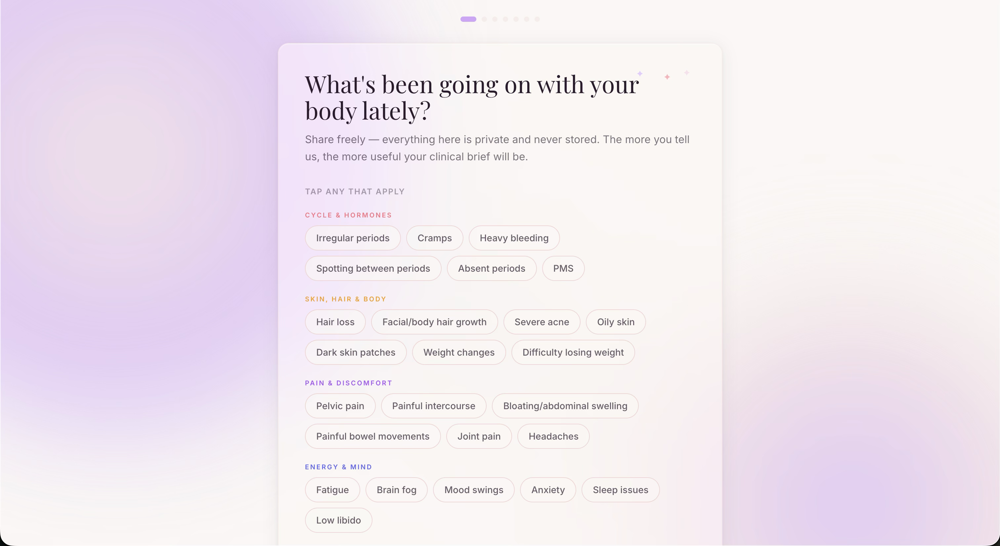
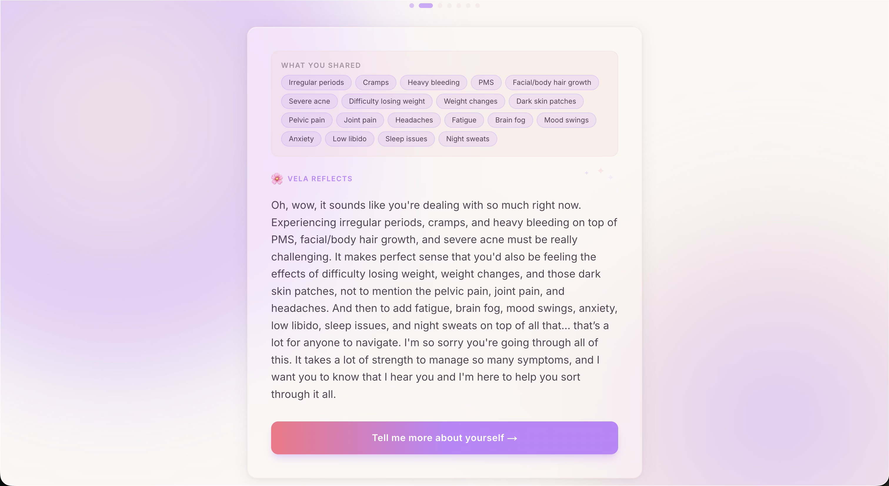
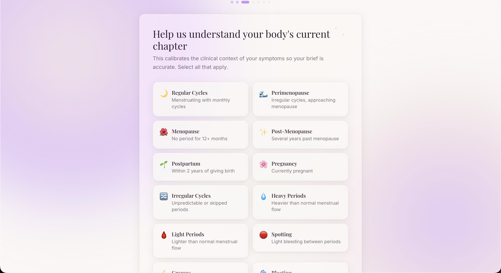
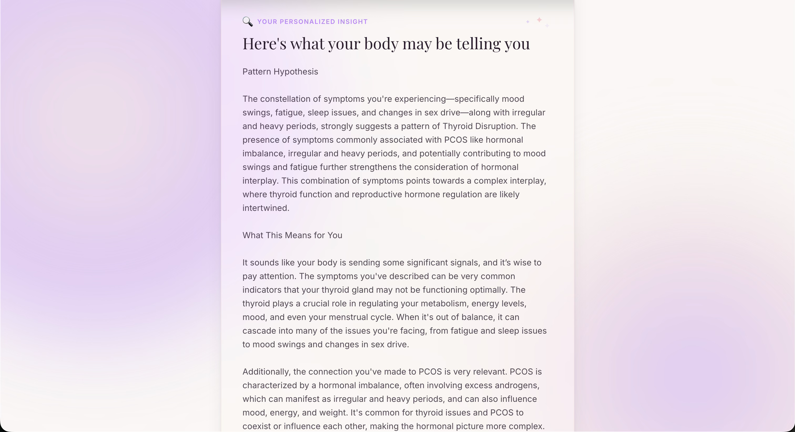

# Vela

**Your symptoms, documented. Your story, told.**

Vela is a private, AI-powered health companion that helps women articulate their symptoms and walk into a doctor's appointment prepared. It guides you through a short conversation, then generates a clinical-grade pre-visit brief you can download as a PDF.

---









---

## Why it exists

Women are dismissed in medical settings at a rate that is hard to overstate. Symptoms get minimized, appointments run short, and by the time you're sitting across from a doctor you've been waiting weeks to see, it can feel impossible to say everything you meant to say.

Vela started because of that feeling. The idea was simple: what if you could have a quiet, unhurried conversation before the appointment, and arrive with a document that speaks for you when the words don't come? Not a list of complaints, but a structured clinical picture that a doctor could actually act on.

It is not a diagnostic tool. It does not replace medical care. It just helps you show up more prepared and more heard.

---

## How it works

Vela walks you through six steps:

| Step | What happens |
|------|--------------|
| Opening | You describe what has been going on with your body |
| Reflection | The AI offers a warm, personalized reflection on your symptoms |
| Life Phase | You select your current hormonal life phase (perimenopause, postmenopause, etc.) |
| Insight | The AI surfaces a structured clinical pattern based on what you shared |
| Follow-up | Three to five deep follow-up questions asked one at a time |
| PDF Brief | A clinical pre-visit document is generated and downloaded as a PDF |

---

## Tech stack

| Layer | Technology |
|-------|------------|
| Framework | [Next.js](https://nextjs.org) (App Router) |
| AI | [Gemini 2.5 Flash Lite](https://app.router.tetrate.ai) via tetrate.ai, or [DeepInfra](https://deepinfra.com) |
| Streaming | OpenAI-compatible SSE |
| State | [Zustand](https://zustand-demo.pmnd.rs) (in-memory only, no persistence) |
| PDF | [pdfmake](https://pdfmake.github.io/docs/) (server-side generation) |
| Animation | [Framer Motion](https://www.framer.com/motion/) |
| Styling | [Tailwind CSS](https://tailwindcss.com) |

---

## Local setup

### Prerequisites

- Node.js 18 or later
- npm, pnpm, or yarn

### 1. Install dependencies

```bash
npm install
```

### 2. Configure environment variables

```bash
cp .env.example .env.local
```

Open `.env.local` and fill in the values below.

| Variable | Required | Description |
|----------|----------|-------------|
| `TETRATE_API_KEY` | Yes | API key for tetrate.ai. Get one at [app.router.tetrate.ai](https://app.router.tetrate.ai). |
| `TETRATE_BASE_URL` | Yes | Base URL for the Tetrate model router (e.g. `https://api.router.tetrate.ai/v1`). |
| `AI_PROVIDER` | Yes | Which provider to use. Either `tetrate` or `deepinfra`. |
| `AI_MODEL_ID` | Yes | Model identifier passed to the chosen provider (e.g. `gemini-2.5-flash-lite`). |
| `KIMI_BASE_URL` | When using DeepInfra | Base URL for the DeepInfra OpenAI-compatible endpoint. |
| `DEEPINFRA_API_KEY` | When using DeepInfra | API key for DeepInfra. Get one at [deepinfra.com/dash/api_keys](https://deepinfra.com/dash/api_keys). |
| `RATE_LIMIT_ENABLED` | Yes | Set to `false` for local development. Set to `true` in production to enforce 50 requests per IP per 24 hours. |

### 3. Run the development server

```bash
npm run dev
```

Open [http://localhost:3000](http://localhost:3000) in your browser.

### 4. Build for production

```bash
npm run build
npm run start
```

---

## Privacy

There is no database. Conversation data lives only in your browser's JavaScript memory for the duration of the tab session. Nothing is stored on any Vela server.

The server logs only rate-limit violations (IP address and count). No symptom content, no personal information.

When the session ends — whether by downloading the PDF or closing the tab — the Zustand store is destroyed and the data is gone.

---

## License

MIT
